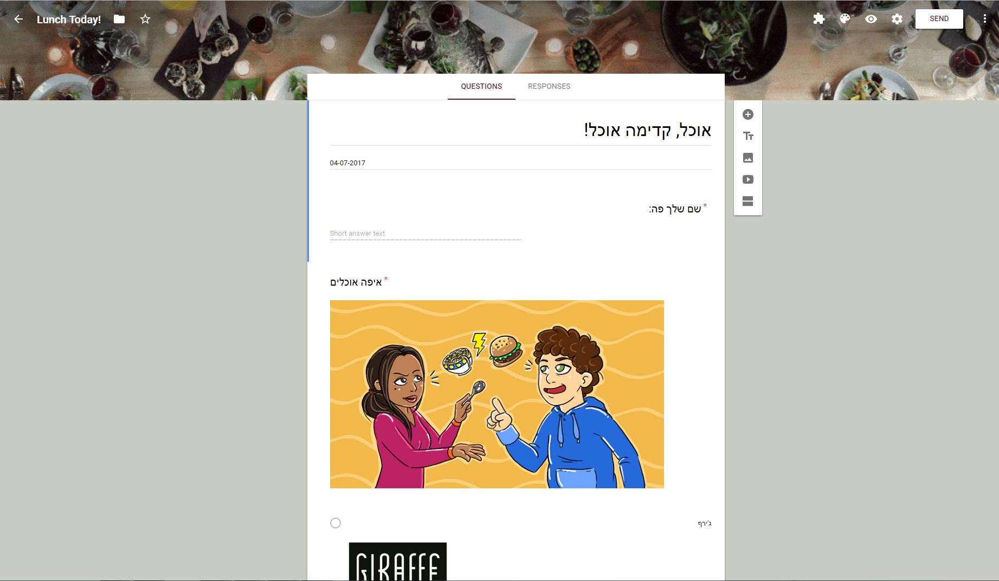
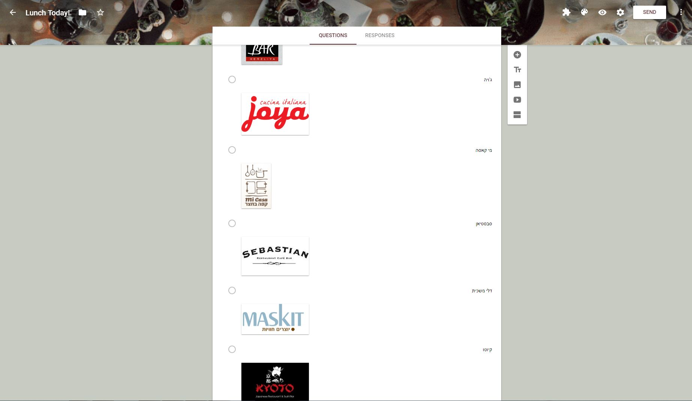

# LunchPoll
Lunch poll, written in google apps script!

## This script sends a google form with lunch options each day, except for holidays and weekends.

### Notes:
* **Weekend is set for Friday/Saturday configuraion but can be changed for Saturday/Sunday.**
* **Holidays are for Israel (isr), but can also be changed to another country.**

### Things you need for this google apps script are:

1. Google form, created by your own vision (see my form below)
2. Folder to hold your script file (optional)
3. Folder to hold your output responses sheet file (optional) 
4. Slack channel to post links to the form and to the responses sheet + incoming webhook (optional)
5. Set up a trigger for this script to run daily

#### Properties needed for this app (defined in "script properties"):
* LUNCH_FORM_ID
* EMAIL_RECIPIENTS
* OUTPUT_FOLDER_ID
* LUNCH_FOLDER_ID
* SLACK_WEBHOOK_URL

#### Additional links:
* http://jivimberg.github.io/blog/2014/08/21/email-google-form-daily/
* https://api.slack.com/incoming-webhooks

